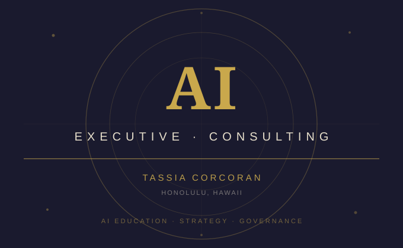

## Overview

As AI becomes embedded in everyday business operations, many executives and organizational leaders find themselves making high-stakes decisions about tools and systems they don't fully understand. This consulting practice bridges that gap — delivering structured, accessible AI training designed specifically for business leaders with no technical background.

To date, I have trained **100+ executives** across private sessions and organizational engagements, with upcoming presentations at the **Hawaii Chamber of Commerce** and the **Hawaii Labor Summit (June 2026)**, where I will lead two sessions on AI in the workplace:

- *AI in the Workplace: Risks, Accountability, and Worker Protections*
- *Leveraging AI to Support Workers and Labor Organizations*

Sessions are structured to meet participants where they are — whether a group of 8 senior leaders or a room of 50 — and adapt in depth and specificity based on the audience's industry, needs, and existing AI maturity.

---

## Training Structure

The consulting engagement is designed as a progressive curriculum. The first session establishes a shared foundation of AI knowledge, ensuring all participants — regardless of prior exposure — can engage in informed, strategic conversations about AI adoption.

### Session 1 — AI Foundations (All Audiences)

The foundational session demystifies AI at the conceptual level before moving into practical business application. Topics include:

- **What AI actually is** — and what it isn't. Participants learn to distinguish between AI, Machine Learning, Deep Learning, Generative AI, and Large Language Models, so they can accurately evaluate tools and vendor claims.
- **How AI learns** — using accessible analogies (pattern recognition, labeled data, the "black box" problem) to explain how models are trained without requiring technical expertise.
- **Why these distinctions matter** — most enterprise data analysis relies on Machine Learning, not Generative AI. Executives who don't understand the difference risk misaligned tool selection and governance gaps.

  <iframe src="../img/AI_training_sample.pptx.pdf" width="100%" height="600px" style="border: 1px solid #ddd; border-radius: 4px;">
    
Your browser does not support PDF viewing. <a href="../img/AI_training_sample.pdf" target="_blank">Click here to download the sample slides</a>

  </iframe>

  <a href="../img/AI_training_sample.pptx.pdf" target="_blank">
    <i class="file pdf icon"></i> Download Sample Slides (PDF)
  </a>

### Subsequent Sessions — Tailored by Audience

After the foundation session, the curriculum adapts based on the organization's industry, workforce, and specific AI use cases. Typical advanced topics include:

- **Security & risk** — data privacy, vendor risk, shadow AI, and what executives are legally responsible for when AI is deployed in their organization
- **Emerging technology** — agentic AI, automation workflows, and what's coming in the next 12–24 months that leadership needs to prepare for
- **AI use cases** — practical, industry-specific examples of where AI creates real operational value — and where it doesn't
- **Liability & accountability** — regulatory landscape, organizational policy requirements, and how to build governance structures that protect the business and its workers

---

## Approach

This is not generic AI awareness training. Each engagement begins with a readiness assessment and workflow analysis to understand where the organization currently stands and where AI adoption is most likely to create value — or risk.

The goal is not to make executives AI engineers. It's to give them the **conceptual fluency and decision-making framework** to lead AI initiatives responsibly, evaluate vendor claims critically, and ask the right questions of their technical teams.

---

## Upcoming Public Engagements

| Event | Date | Sessions |
|---|---|---|
| Hawaii Labor Summit | June 29, 2026 | AI in the Workplace: Risks, Accountability, and Worker Protections · Leveraging AI to Support Workers and Labor Organizations |
| Hawaii Chamber of Commerce | 2026 (upcoming) | Executive AI Readiness |

---

## Impact

The organizations and leaders who go through this training come away with a working mental model of AI — one that holds up under real business conditions. They're better equipped to evaluate tools, set policy, protect their workforce, and lead AI adoption with intention rather than reaction.

> *"Her work focuses on helping organizations understand and implement AI in practical ways through readiness assessments, workflow analysis, and the development of AI use cases that support real operational needs."*
